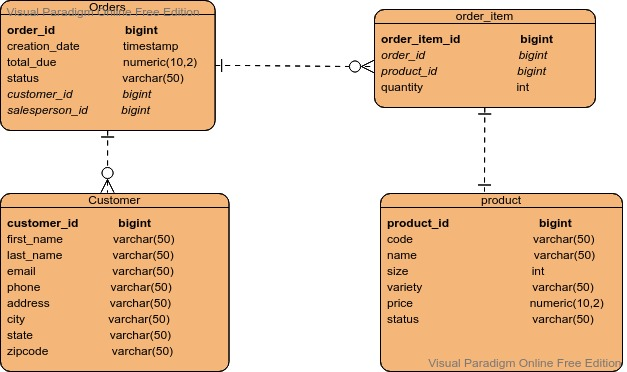

# Introduction
This is a very basic implementation of a program for entering customers into a database and 
retrieving info about them. The database is implemented using PostgreSQL running inside a Docker 
container and the program makes use of JDBC and the SQL Java libraries. Dependencies where managed
using Maven and version control was done through git, with Github as central repository.

# Implementation
## ER Diagram

## Design Patterns
Our calls to the database were all embedded in a DAO called CustomerDAO. This enables us to isolate the queries from the
rest of the code, thus adding robustness and refactorability: someone working on the Customer or JDBCExecutor classes in
the future would not have to know how the queries are implemented and could not do much to break them. Remains the
matter of making a decision between working with repositories or keeping any complex future queries in DAO classes. For
now, while the database is situated on a single system, it makes more sense to leverage the database to do joins and
other complex queries. If we were to scale out this database and distribute on various systems, we would have to look
into the question of maybe using repositories to join data inside our Java code.

# Test
All testing was manual. A large sample of customers and some orders were fed to the database to populate it. It was then
easy to use our DAO methods from inside our main method to insert more data and/or execute SELECT queries and verify if 
the results were as expected.