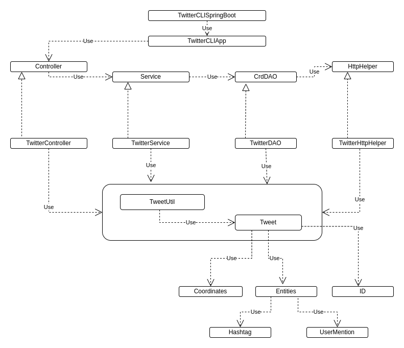

# Introduction
This app is meant to manage the most common Twitter operations: to create and post a tweet, to retrieve and show the most important informations about a tweet and to delete a tweet. It uses a java HTTP client to communicate with the Twitter Rest API, authenticating with the OAuth protocol 1.0. It manages the information extracted from tweet using the javax json library. It manages depencies using Maven and the Spring framework, while being wrapper in a Docker container for convenience of use.

# Quick Start
- The app should be packaged using `mvn clean package`. The tests will be run autimatically.
  - A docker image then needs to be built: `docker build -t ${docker_user}/twitterapp .`
  - Four keys and tokens needs to be obtained from the Twitter Developper portal to access the REST API through the app, as oneself. They need to be entered as environment variables in a file named `.env` and created at the root of the project, with the names TWITTER_API_KEY, TWITTER_API_SECRET, TWITTER_ACCESS_TOKEN and TWITTER_ACCESS_SECRET. Make sure to exclude this .env file from the staging area.
- The command then used to launch the app will be `docker run --env-file .env --rm ${docker_user}/twitterapp command arg1 arg2(optional)`

# Design
## UML diagram

## Components
- TwitterCLI (SpringBoot/App): Dependencies are put together, the app is launched and some very basic filtering is done
before passing the arguments to the Controller;
- Controller: Here, arguments are parsed and some filtering is made that has to do with options and/or fields, 
  before passing the parsed arguments to the Service layer;
- Service: Here, arguments are further filtered to ensure their conformity with our model, before passing them to the
DAO layer. Some processing is also made when the information bubbles up to format the information according to the 
  choices of the user;
- CrdDAO: This is a very important layer, where the HTTP client is called, where the URL to be sent to the REST API is
formatted and where the response received from the REST API is processed.

## Models
Our Tweet model contains the information we think our user needs the most. This includes date of creation, id, text, 
coordinates and info about retweets, likes, hashtags and user mentions. Some of them are represented using primitives,
while for some others, objects were created so their manipulation would be more robust and easier to refactorize over
time.

## Spring
Dependencies were managed using the Spring framework in order to avoid a chain of dependencies in our TwitterCLIApp
class which would not fare well for the maintainability of our app. Each component in the core chain of dependencies had 
to be annotated for the SpringApplication instance to be able to scan them.

# Test
For each component of the app, a battery of unit tests was produced, using Mockito as a way to only test the 
functionality of this layer by providing mock dependencies to the constructors. A battery of integration tests was
written at the Controller level to detect problems that would not have been detected at the unit tests level, as well
as connection and authentication problems.

## Deployment
The app is dockerized using an openjdk11 image, to which commands are sent from the terminal itself. The environment
variables needed by the app are set from outside the container. No persistence of data outside of the Twitter server is
intended.

# Improvements
- The tweet model used by this app reaches a certain complexity which is not justified by the scope and simplicity of 
its uses. The app is thus meant to be developed further in order to fully exploit this complexity:
  - The app could be made to keep running after being launched and receive many commands in any one running;
  - Some form of caching could be implemented and the Tweets could thus be serialized and saved, to be de-serialized on
  the next run and consulted (after checking if they are still up to date with the server), thus saving processing time.
- Displaying of tweet info could be more user-friendly and be formatted without showing the components of the JSON 
syntax.
