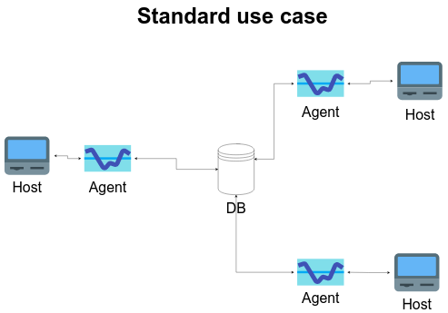

# Linux Cluster Monitoring Agent

## Introduction
This agent is used to automatically gather hardware as well as memory and CPU usage information on a system.
It gathers usage info every minute, as long the database instance is properly running. It is meant to run on any user's
session but does so in the background and should not necessitate user's intervention once launched. Queries are provided to obtain:
* User id and Total memory available, ordered by the number of CPUs;
* Groups of timestamps covering five minutes, with host name and average memory used over that time;
* Timestamps for 5 minutes intervals where less than three entries where made, labeled as server failures (intervals
with no entries at all are not included, as they may denote a time when the system was shut down or the agent was not
running).  

It was implemented using bash scripts and a PostgreSQL database running inside a Docker container. Version control is 
done using Github.

## Quick Start
* Starting a psql instance:
  * `./scripts/psql_docker.sh start` from the root folder
* Creating tables:
  * `./sql/ddl.sql` from the root folder
* Insert hardware data into the database:
  * `./scripts/host_info.sh` from the root folder. This needs to be done only once per system, and won't create any 
  subsequent entry
* You can also create a usage data entry manually:
  * `./scripts/host_usage.sh` from the root folder.
* Automating the script:
  * Open the crontab file typing `crontab -l`;
  * On a new line, enter `* * * * * [PATH_TO_PROJECT_ROOT_FOLDER]/scripts/host_usage.sh localhost 5432 host_agent 
  postgres password > /tmp/host_usage.log`;
  * Save and exit.

## Implementation
The project is implemented by first setting up a Github repo and then obtaining the appropriate Docker image, 
containing a PostGreSQL installation. The psql_docker.sh script is written, that will let us create, start and stop a
Docker container based on this image. The ddl.sql script is then written to create the tables and views that will be
needed. Both the host_info and the host_usage scripts are then written and designed to insert the data they obtain
directly in our Docker-run database. This has to be tested because the next steps depend on data produced by these
scripts. It is a good idea to run the host_info script and to inscribe the host_usage script into the Crontab file, as
the data thus produced will be useful for the next step, where we will write the queries provided with this agent, using
the views in sql/ddl.sql, aggregations and junctions.

## Architecture

## Scripts
* scripts/psql_docker.sh
  * This script creates, starts or stops a Docker container with a running PostgreSQL instance. Data persistence in 
  assured by pairing with a local directory. Usage is: `./scripts/psql_docker.sh create|start|stop`
* scripts/host_info.sh
  * This script gathers the static hardware info of a system. It also detects if there is already a record for a 
  particular system and immediately exits if this is the case, as there is no point in gathering redundant information.
  It is launched as is, with no argument: `./scripts/host_info.sh`
* host_usage.sh
  * This script gathers the usage data of a system and enters it into the database. It is the one that is meant to run 
  every minute. It does not have to be launched manually. 
* crontab
  * This command opens the file that receives an entry instructing it to run our host_usage.sh script every minute. It 
  does not need to be modified beyond that. 
* sql/ddl.sql
  * This is the script that creates the two tables we need as well as two views needed to simplify the queries provided
  with the program. It is given as an argument to a psql command to our database: `psql -h localhost -U postgres -d 
  host_agent -f sql/ddl.sql`
* queries.sql 
  * This is where we will find the provided queries. They are meant to give us an indication of the relationship between
  the number of CPUs and total memory for the monitored systems, the average memory usage of those systems, as well as
  to report possible failures of the system or of the server.

## Database Modeling
Tables structure:
* `host_info`
|id|hostname|cpu_number|cpu_architecture|cpu_model|cpu_mhz|L2_cache|total_mem|timestamp|  
--- | --- | --- | --- | --- | --- | --- | --- | --- |  
8 | jrvs-remote-desktop-centos7.us-east1-c.c.phrasal-bonus-340017.internal |  
        2 | x86_64           | AMD EPYC 7B12 | 2249.998 |      512 |   8005740 |
 2022-02-11 21:55:16
* `host_usage`

# Test
How did you test your bash scripts and SQL queries? What was the result?

# Deployment
How did you deploy your app? (e.g. Github, crontab, docker)

# Improvements

A note for later: date is in UTC. Check if that is the time to use.  
A script should be made to test arguments for both host_info.sh and host_usage.sh: some redundancy would be avoided.

Connecting to psql instance: psql -h localhost -U postgres -d host_agent