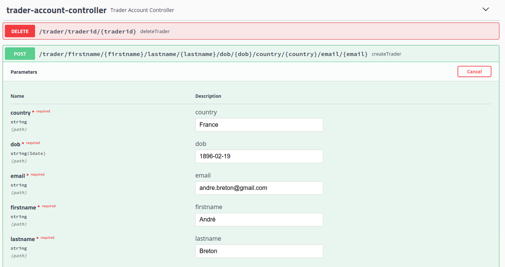
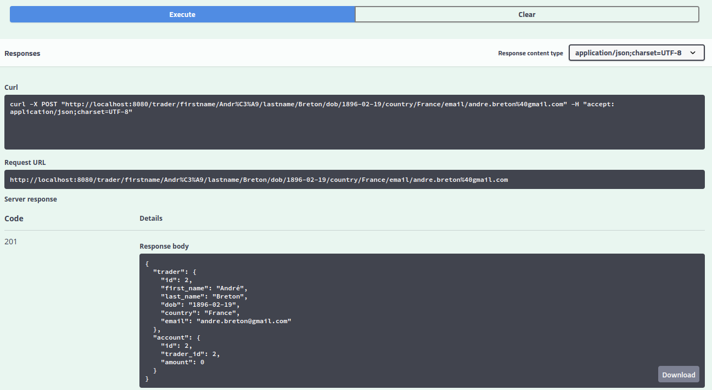

Table of contents
* [Introduction](#Introduction)
* [Quick Start](#QuickStart)
* [Implementation](#Implementation)
* [Test](#Test)
* [Deployment](#Deployment)
* [Improvements](#Improvements)

# Introduction
Our trading team needed to replace their legacy trading platform with something more efficient, maintainable and 
scalable. The platform we built for them is a REST API meant to manage traders and their accounts, execute security
orders and get information about quotes. The app was developed inside the Spring Boot framework with data persistence
ensured by a postgresql database, connected through JDBC. It is meant to be run inside two docker containers, one for 
the app and one for the database.

# Quick Start
- Prerequisites: 
    - Docker 17.05 or higher needs to be installed on the host system;
    - Any Linux distro.
    - root privileges
    - IEX Cloud account and public token
- Docker scripts:
    - Build images:
      - From the command line, with working directory being the root of the project (the springboot folder), the 
      image-building script should be launched with the `./dockerScripts/buildImages.sh` command.
    - Creating a docker network:
      - `./dockerScripts/createBridge.sh` will then be enough to create the exclusive networking bridge for the app.
      - Starting containers:
        - The IEX public token should be saved as an environment variable of name IEX_PUB_TOKEN, through the command 
        line of otherwise. Simplest method being: `IEX_PUB_TOKEN=yourToken` in a terminal.
        - `./dockerScripts/startContainers.sh`
- Test trading-app with SwaggerUI

# Implementation
## Architecture
- Components of trading platform:
    - Controller layer:
      - The QuoteController handles requests to obtain a current quote for a ticker on the stock market, to save
      such a quote to our database, and to populate a list of quotes for the day;
      - The TraderAccountController handles requests to create traders and their accounts and to consult such
      accounts.
    - Service layer:
      - The QuoteService validates requests from the QuoteController and calls methods from the corresponding 
      DAOs to complete them and return an object containing the information needed on the view layer, if 
      applicable;
      - The TraderAccountService works in a way similar to the QuoteService, serving the TraderAccountController. 
    - DAO layer:
      - The JdbcCrudDao is an abstract class enabling us to regroup most functionalities of similar DAOs inheriting from 
      it, like, for example, most DTO objects creation, using an EntityUtil interface object enabling it to instantiate 
      them without having to know what they are, since every DAO instantiate its own version of the Util. The DAOs only 
      need to implement the logic that is specific to them, which is often not than many methods;
      - The AccountDao extends JdbcCrudDao and is responsible for interacting with the account database table;
      - The MarketDataDao is different, has it does not extends JdbcCrudDao and is responsible for the interactions 
      with the IEX cloud and the creation of IexQuote objects through calls to IexQuoteUtil. The IexQuote object is a
      temporary object meant to hold the information for the creation of an actual Quote object (this differentiation
      might help a lot with further development of the app);
      - The PositionDao extends JdbcCrudDao and is responsible for querying the position view;
      - The QuoteDao extends JdbcCrudDao and is responsible for interacting with the quote database table;
      - The SecurityOrderDao extends JdbcCrudDao and is responsible for interacting with the security_order database
      table;
      - The TraderDao extends JdbcCrudDao and is responsible for interacting with the trader database table.
    - SpringBoot: webservlet/TomCat and IoC
      - Our app is managed using the Springboot framework and served with TomCat. It uses inversion of control to 
      manage the creation of our components and their multiple dependencies on each others.
    - PSQL and IEX
      - Data is saved inside a PostgreSQL database and quotes are retrieved from the IEX Cloud REST API, all using the
      JDBC interface.

## REST API Usage
### Swagger
The Swagger browser-based user interface was used through development, along with Postman, to understand and test the 
behaviour of both our app and the IEX Cloud API. Swagger is suggested as a mean of exploring our PoC for its ease of use 
and its high legibility.
### Quote Controller
- The Quote Controller receives requests concerning both quotes from IEX Cloud and from our own database:
  - GET `/quotes/iexquote/{iexquote}`: displays one quote, directly retrieved from IEX, for the ticker provided;
  - GET `/quotes/dailyList`: lists all securities that are available to trading in this trading system;
  - PUT `/quotes/`: enters a quote into the database, with data provided by the user and without checking it the ticker exists;
  - POST `/quotes/tickerid/{tickerid}`: retrieves a quote from IEX, saves pertinent data into our database and returns the 
  Quote object (JSON format).
### Trader Account Controller
- The Trader Account Controller receives requests concerning traders and their account and also enables deposits and 
withdrawals from the latter:
  - POST `/trader/firstname/{firstname}/lastname/{lastname}/dob/{dob}/country/{country}/email/{email}`: creates a trader
  into the trader database, using data provided by the user, and also creates a new account with an amount of zero,
  relating it to the newly created trader;
  - DELETE `/trader/traderid/{traderid}`: deletes the trader associated with provided id. Amount in account has to be
  zero and no open orders can be left associated with that trader;
  - PUT `/trader/deposit/traderid/{traderid}/amount/{amount}`: deposits funds in the account associated with that
  trader's id;
  - PUT `/trader/withdraw/traderid/{traderid}/amount/{amount}`: withdraws funds from the account associated with that
    trader's id;

# Test
Application was tested mostly with integration tests, using JUnit. Most tests interacts with a database: a db that was
created for test purposes and the IEX Cloud API when applicable. A more robust testing protocol would need to mock the 
behaviour of this API, but doing as we did was perfect for the context of this PoC. More than half the lines of code 
where tested in the DAO and service components.

# Improvements
Many things would need to be improved if we were to develop this app any further. Among them:
- Data persistence would need to be ensured by adjoining a dedicated volume to our psql container. Both containers used
would also need to be able to interact over a real network;
- The security of our app, as it is, is non-existent. We would need to encrypt passwords and tokens and ensure that 
communication between components is secure;
- Much more business logic would need to be implemented. Analysis of data, for example, would be an important feature
to make the platform of interest to our trading team.
